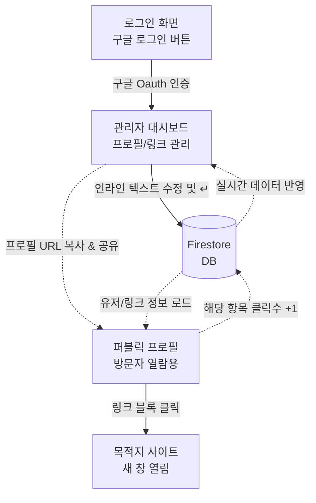

# 마이링크 (MyLink) 화면 설계서 (Wireframe)

본 문서는 `shadcn/ui` 모던 컴포넌트 환경을 대비하여 마이링크의 핵심 화면인 **퍼블릭 페이지(방문자용)**와 **대시보드(소유자용)**의 구조를 ASCII 아트와 Mermaid 다이어그램으로 설계한 와이어프레임입니다.

---

## 1. 퍼블릭 프로필 페이지 (Public Page)
방문자가 SNS 등을 통해 내 링크(`mylink.com/displayName`)에 접속했을 때 보게 되는 모바일 최적화 화면입니다.

```text
+------------------------------------------+
|                                          |
|               [ 프로필 이미지 ]             |
|                                          |
|                username (실명)            |
|               @displayName (닉네임)       |
|                                          |
|       안녕하세요! 제 소개글(Bio)이 이곳에     |
|       최대 2~3줄로 깔끔하게 노출됩니다.       |
|                                          |
|                                          |
|  +------------------------------------+  |
|  | [파비콘] 유튜브 채널 바로가기           |  |
|  +------------------------------------+  |
|                                          |
|  +------------------------------------+  |
|  | [파비콘] 깃허브 포트폴리오 구경하기      |  |
|  +------------------------------------+  |
|                                          |
|  +------------------------------------+  |
|  | [파비콘] 개인 기술 블로그               |  |
|  +------------------------------------+  |
|                                          |
|                                          |
|             Powered by MyLink            |
+------------------------------------------+
```
* **적용 예상 컴포넌트(shadcn/ui)**: `Avatar`, `Button` (가로 확장형), `Typography` 등
* **레이아웃 제약 사항**: 데스크탑 등 넓은 웹 환경에서도 모바일 특화 비율을 유지하기 위해, 전체 구조(Wrapper)의 최대 너비를 `max-w-md` (약 448px 내외)로 묶어두고 화면의 정중앙에 배치(`mx-auto`)합니다.
---

## 2. 관리자 대시보드 (Admin Dashboard)
채널 소유자가 로그인(`mylink.com/admin` 혹은 루트 경로 접속 시 렌더링)하여 볼 수 있는 내부 링크 관리 화면입니다. **인라인 편집(✏️)** 및 **실시간 통계**를 직관적으로 확인할 수 있게 1단 세로 구조(Mobile-first)로 디자인했습니다.

```text
+------------------------------------------+
|  🔗 MyLink                  [로그아웃]  |
+------------------------------------------+
|                                          |
|  나의 프로필 주소 (공유하기)                 |
|  [ 📋 mylink.com/displayName      [복사]] |
|                                          |
| ──────────────────────────────────────── |
|  👤 내 프로필 정보                          |
|                                          |
|  [ 프로필 ] ✏️                            |
|                                          |
|  실명 입력... ✏️                          |
|  @displayName ✏️                        |
|  소개글을 적어주세요. ✏️                    |
|                                          |
| ──────────────────────────────────────── |
|  ✨ 새로운 링크 추가                         |
| +--------------------------------------+ |
| | 🌐 이동할 URL을 입력하세요...      ✏️    | |
| | 📝 버튼에 보일 텍스트를 입력하세요... ✏️    | |
| |                               [추가↵] | |
| +--------------------------------------+ |
|                                          |
| ──────────────────────────────────────── |
|  📊 내 링크 목록 및 클릭 통계               |
|                                          |
| +--------------------------------------+ |
| | [유튜브 파비콘] 유튜브 채널 바로가기 ✏️ [🗑️]| |
| |  ↳ https://youtube.com/mych.. ✏️     | |
| |  👀 누적 클릭수: 45회                   | |
| +--------------------------------------+ |
|                                          |
| +--------------------------------------+ |
| | [깃허브 파비콘] 깃허브 포트폴리오 ✏️    [🗑️]| |
| |  ↳ https://github.com/...  ✏️        | |
| |  👀 누적 클릭수: 12회                   | |
| +--------------------------------------+ |
+------------------------------------------+
```
* **적용 예상 컴포넌트(shadcn/ui)**: `Card`, `Input` (인라인 편집 시 활성화), `Toast` (복사 성공 시), `Dialog/Alert` (삭제 시)
* **레이아웃 제약 사항**: 퍼블릭 페이지와 동일하게 관리자 대시보드 역시 화면 가로 폭을 스마트폰 비율(`max-w-md`) 기준으로 제한하고 화면 정가운데를 띄워 인터페이스 통일성을 제공합니다.
---

## 3. 화면간 정보 흐름도 (Screen Flow)
화면 이동 및 각 화면에서 데이터베이스(Firestore) 접근이 어떻게 이루어지는지 보여주는 Mermaid 다이어그램입니다.


